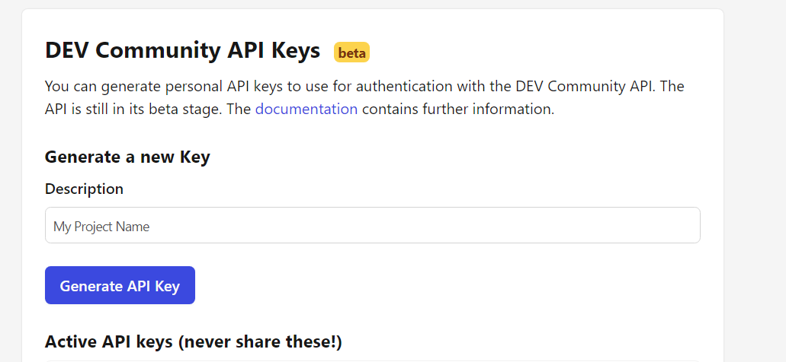
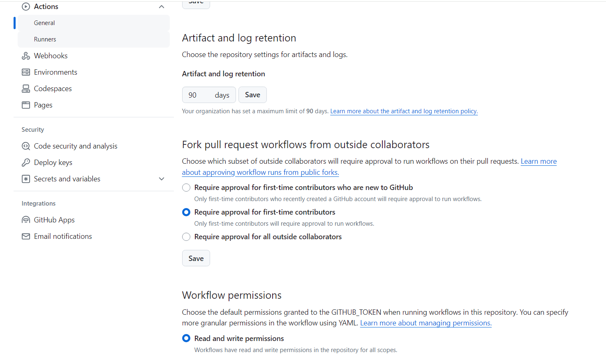
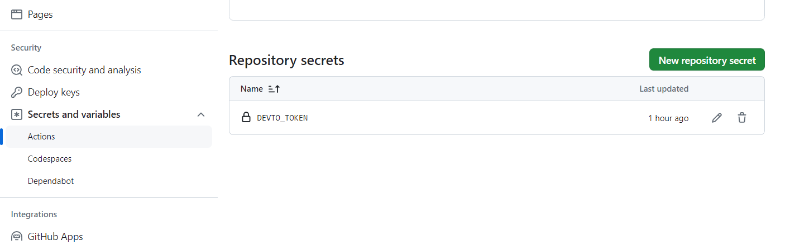
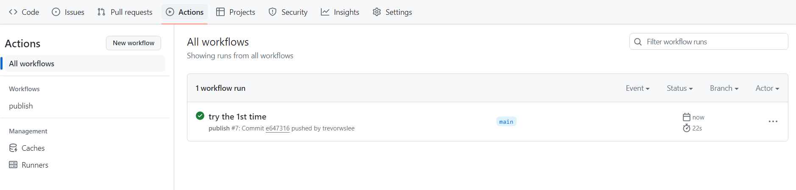

# GitHub Repository README to DEV Community  Post


The enabler of the capability is a GitHub Action workflow contributed by the [publish-devto](https://github.com/sinedied/publish-devto) project

Hence, the picture


which is the sample that comes with the `publish-devto` project. 

Here I will simply show how I setup GitHub repo for automatically posting README (`README.md`) to DEV Community (`dev.to`).

## On Dev Community Side

As expected, you will need some "access token" from `dev.to` for the workflow to work.

Indeed, you need get an API token from `dev.to` -- `Settings` -> `Extension` -> `DEV Community API Keys`



## On GitHub Side

GitHub also requires some [repository] settings for security measures.

Firstly, grant "read and write permissions" to "Workflow" -- `Settings` -> `Actions | General` -> `Workflow permissions` set to `Read and write permissions`



Secondly, setup `DEVTO_TOKEN` secret (the API token you acquired in previous step) -- `Secret and variables | Actions` new `Repository secrets` 



***It appears that the repository needs be a public one.*** Otherwise, `dev.to` will fail to acquire the images.

## On Repo Source Side

Firstly, you will need `.github/workflows/publish.yml` that you can download [here](https://github.com/trevorwslee/readme_to_devto/blob/main/.github/workflows/publish.yml), which is one that I tailored from the one that comes with the `publish-devto` project

Secondly, your `README.md` will need to have *headers* (starting from 1st line) like

```
---
title: GitHub Repository README to DEV Community Post
description: Setup GitHub repo for automatically posting README to DEV Community  
tags: 'github, readme, devto'
cover_image: ./assets/cat.jpg
published: false
---
```

Notes on the *headers*:
- `title` should be set correctly the first time, and should not be changed (unless you want to start a new post)
- `description` is optional (i.e can be missing)
- `tags` is optional, which is a list of comma-delimited single-words
- `cover_image` is optional
- `published` should be `false` until you want to publish the post
- the first successful trigger of the `publish` workflow, `id` will be added automatically (`README.md` modified in the repo, and need be pulled)
  without the `id`, post will be treated as a new post


## Commit Repo

That is it!

Commit and push the changes to GitHub, you should see the running of the workflow `publish`.



If the workflow is successful, a new draft post will be created on Dev Community (`dev.to`)

***Be reminded that the first time successful running of the workflow, `id` will be automatically added to the *headers* of `README.md`.*** Pull for the addition.


***Hope this helps!***


# Enjoy!

> Peace be with you!
> May God bless you!
> Jesus loves you!
> Amazing Grace!
